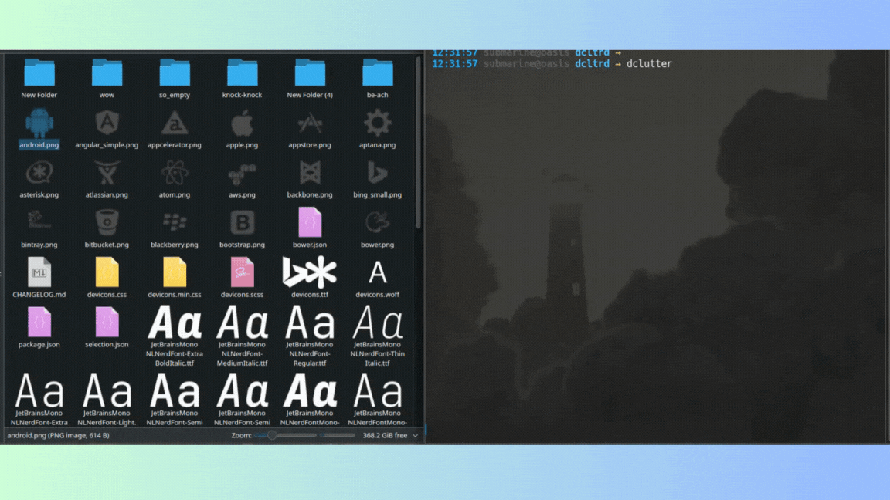

# dclutter

`dclutter` is a bash script designed to help manage and organize your cluttered directories with ease. This script offers various options to categorize, clean up, and manage files efficiently.

<p align="center">

</p>

## Features

- Organize images (`-i`): Segregate image files into a designated folder.
- Recent updates (`-r [/days]`): Separate files into two directories—one for files older than the specified number of days and another for newer files.
- Dump files (`-d`): dump all files from all the subdirectories present.
- Undo actions (`-u`): Revert the last performed action.
- Help (`-h`): Display help information and usage instructions.


## Installation

To use dclutter, you need to have bash installed on your system. Clone the repository and make the script executable:

```bash
git clone https://github.com/roguexsubmarine/dclutter.git
cd dclutter
chmod +x dclutter
```
    
## Usage

Below are the available options and their descriptions:
- No option: Segregates files into predefined categories.
- `-i` : Segregate image files (png, svg, jpg, raw, tiff) into a designated folder.
- `-r [/days]` : Separate files into two directories—one for files older than the specified number of days and another for newer files.
- `-d` : Dumps all the files from current directories and subdirectories in current directory.
- `-u` : (Undo) Revert the last performed action.
- `-c` : Remove empty directories.
- `-w` : Renames the files to replace whitespaces with an underscore '_'
- `-x` : Cleans the log file stored for purposes of undo operations.
- `-h` : Display help information and usage instructions.

### Example

 #### 1. dclutter
```bash
dclutter
```
The basic command parses through all files in the current directory and segregates them into categories such as:
    
- Images
- Documents
- Code/Text Files
- Compressed Files
- Audio Files
- Videos
- Bootable Files (ISO images)
- Binaries

 #### 2. Recent updates
```bash
dclutter -r 2
```
This command creates directories and separates files in the current directory into two categories:

- Files older than 2 days
- Files created or updated in the past 2 days

 #### 3. Organize image
```bash
dclutter -i
```
This option identifies images and categorizes them into their respective types, including:

- JPEG
- PNG
- SVG
- TIFF
- HEIF
- GIF
- WebP
- Netbpm
- AI
- Bitmap
- PostScript

The images are then stored in their respective subdirectories.
### Lessons Learned
Through the development of this script, I have deepened my understanding of shell scripting and gained proficiency in using commands such as `grep`, `file`, and `awk`.


